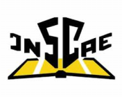

[TL;DR](https://github.com/beskikoo/project-euler/blob/main/README.md#tldr)

# Project Euler Solutions

Mathematical and Programming skills... **the take** of an _Accountant_ by education.

Learn, **unlearn** and relearn

🔥 🔥 🔥 💪 💪 💪 💝 💝 💝

## Educational and Professional Backgrounds

Coding, at the bottom line, is **Math** :brain: :brain: :brain: ... and I took some  [MIS](https://en.wikipedia.org/wiki/Management_information_system) and Coding _primer courses_ during my graduation. Last but not the least [Business mathematics](https://en.wikipedia.org/wiki/Business_mathematics) was also part of the game.

We are [Inscae](https://www.inscae.mg/) ...

I was involved in Financial Auditing, Software Development, Venture Capital, Property Management, Public Administration and Business Management.

## Coding and why mostly Delphi and D?

Relevant _computer literacy_ right after graduation combined with an _early exposition_ to [IBM Personal Computer XT](https://en.wikipedia.org/wiki/IBM_Personal_Computer_XT) at work since first job helped me a lot _Starting the Ball Bolling_.

- [Delphi](https://www.embarcadero.com/products/delphi) (11 Alexandria) my language of choice.
- [DMD](https://tour.dlang.org/tour/en/welcome/welcome-to-d) (Version 2) for side projects.

I may seldom upload some [R](https://www.r-project.org/about.html), [MiniZinc](https://www.minizinc.org/) and [C++](https://fr.wikipedia.org/wiki/C%2B%2B) pieces of code later on.

## The Project Euler

**Giving back** is the motto. This repository is yours!

_Smart Young People_, I'm talking to **You** and if you dream of it... take notice: The [Project Euler](https://projecteuler.net) is the best way to go.

## TL;DR

Let's dive in Together... we have got a way to go, a very very long journey.

- Not so short [List of solutions](solutions.md)

| [1..50]() | [51..100]() | [101..150]() | [151..200]() | [201..250]() | [251..300]() | [301..350]() | [351..400]() | [401..450]() | [451..500]() 
| [501..550]() | [551..600]() | [601..650]() | [651..700]() | [701..750]() | [751..800]() | [801..850]() |

Otherwise direct to point:

- [D](https://github.com/beskikoo/project-euler/tree/main/dlang)
- [Delphi](https://github.com/beskikoo/project-euler/tree/main/delphi)
- [R](https://github.com/beskikoo/project-euler/tree/main/R)
- [C++](https://github.com/beskikoo/project-euler/tree/main/c%2B%2B)
- [MiniZinc](https://github.com/beskikoo/project-euler/tree/main/minizinc)
